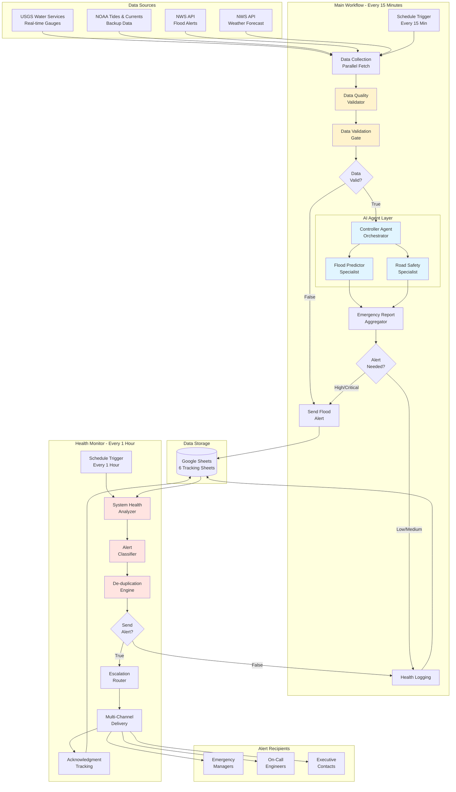

# Houston Flood Monitoring System - Architecture Diagram

## System Overview

This document provides visual representations of the system architecture for the Houston Flash Flood Monitoring & Evacuation System.

---

## 1. HIGH-LEVEL SYSTEM ARCHITECTURE



---

## 2. DETAILED MAIN WORKFLOW ARCHITECTURE

```
┌─────────────────────────────────────────────────────────────────────────────┐
│                        MAIN MONITORING WORKFLOW                             │
│                          (Every 15 Minutes)                                 │
└─────────────────────────────────────────────────────────────────────────────┘

┌─────────────────────────────────────────────────────────────────────────────┐
│  PHASE 1: DATA COLLECTION (Parallel)                                       │
├─────────────────────────────────────────────────────────────────────────────┤
│                                                                             │
│   ┌─────────────────┐         ┌─────────────────┐                         │
│   │  USGS Real-Time │         │ NOAA Tide Gauges│                         │
│   │     Gauges      │         │    (Backup)     │                         │
│   │  HTTP Request   │         │  HTTP Request   │                         │
│   └────────┬────────┘         └────────┬────────┘                         │
│            │                            │                                  │
│            ├───────────┬────────────────┤                                  │
│            │           │                │                                  │
│   ┌────────▼────────┐  │  ┌────────────▼──────┐                          │
│   │  Transform USGS │  │  │  NWS Flood Alerts │                          │
│   │      Data       │  │  │   HTTP Request    │                          │
│   └────────┬────────┘  │  └────────┬──────────┘                          │
│            │           │            │                                      │
│            │     ┌─────▼──────┐    │                                      │
│            │     │ Transform  │    │                                      │
│            │     │ NOAA Data  │    │                                      │
│            │     └─────┬──────┘    │                                      │
│            │           │            │                                      │
│            │     ┌─────▼──────────┐ │                                     │
│            │     │ NWS Weather    │ │                                     │
│            │     │   Forecast     │ │                                     │
│            │     │ HTTP Request   │ │                                     │
│            │     └─────┬──────────┘ │                                     │
│            │           │            │                                      │
└────────────┼───────────┼────────────┼──────────────────────────────────────┘
             │           │            │
┌────────────▼───────────▼────────────▼──────────────────────────────────────┐
│  PHASE 2: DATA VALIDATION & QUALITY CONTROL                                │
├─────────────────────────────────────────────────────────────────────────────┤
│                                                                             │
│            ┌───────────────────────────────────┐                           │
│            │   Data Quality Validator          │                           │
│            │   • Checks 4 data sources         │                           │
│            │   • Calculates confidence         │                           │
│            │   • USGS → NOAA failover         │                           │
│            │   • Data freshness check          │                           │
│            └─────────────┬─────────────────────┘                           │
│                          │                                                  │
│            ┌─────────────▼─────────────────────┐                           │
│            │   Data Validation Gate            │                           │
│            │   • Range validation (0-100 ft)   │                           │
│            │   • Anomaly detection (rise rate) │                           │
│            │   • Completeness checks           │                           │
│            │   • Gauge health monitoring       │                           │
│            └─────────────┬─────────────────────┘                           │
│                          │                                                  │
│                    ┌─────▼─────┐                                           │
│                    │ Data      │                                           │
│                    │ Valid?    │                                           │
│                    │  (IF)     │                                           │
│                    └──┬────┬───┘                                           │
│                 TRUE  │    │  FALSE                                        │
└───────────────────────┼────┼──────────────────────────────────────────────┘
                        │    │
    ┌───────────────────┘    └──────────────────────┐
    │                                                 │
┌───▼────────────────────────────────┐      ┌───────▼──────────────────┐
│  PHASE 3: AI ANALYSIS              │      │  ERROR HANDLING          │
├────────────────────────────────────┤      ├──────────────────────────┤
│                                    │      │                          │
│   ┌─────────────────────────────┐ │      │  ┌───────────────────┐  │
│   │   CONTROLLER AGENT          │ │      │  │  Send Data        │  │
│   │   • Orchestrates workflow   │ │      │  │  Validation       │  │
│   │   • Delegates to specialists│ │      │  │  Error Alert      │  │
│   │   • Synthesizes results     │ │      │  └─────────┬─────────┘  │
│   └──────────┬──────────────────┘ │      │            │             │
│              │                     │      └────────────┼─────────────┘
│    ┌─────────┴─────────┐          │                   │
│    │                   │          │                   │
│ ┌──▼────────────┐  ┌──▼──────────┐│                  │
│ │ Flood         │  │  Road Safety││                  │
│ │ Predictor     │  │  Agent      ││                  │
│ │ Agent         │  │             ││                  │
│ │               │  │             ││                  │
│ │ • Water level │  │ • Road      ││                  │
│ │   forecasting │  │   flooding  ││                  │
│ │ • Time to     │  │ • Evacuation││                  │
│ │   flood stage │  │   routes    ││                  │
│ │ • Severity    │  │ • Road      ││                  │
│ │   scoring     │  │   closures  ││                  │
│ └──────┬────────┘  └──────┬──────┘│                  │
│        │                  │       │                  │
│        └────────┬─────────┘       │                  │
│                 │                 │                  │
│      ┌──────────▼──────────────┐  │                  │
│      │  Emergency Report       │  │                  │
│      │  Aggregator             │  │                  │
│      │  • Combines predictions │  │                  │
│      │  • Synthesizes roads    │  │                  │
│      │  • Generates summary    │  │                  │
│      └──────────┬──────────────┘  │                  │
└─────────────────┼──────────────────┘                  │
                  │                                     │
┌─────────────────▼─────────────────────────────────────┼─────────────────┐
│  PHASE 4: ALERT ROUTING & DISTRIBUTION                │                 │
├────────────────────────────────────────────────────────┼─────────────────┤
│                                                        │                 │
│                ┌───────────────────┐                  │                 │
│                │   Switch Node     │                  │                 │
│                │   Route by        │                  │                 │
│                │   Threat Level    │                  │                 │
│                └──┬─────┬────┬─────┘                  │                 │
│         HIGH/CRIT │     │    │ LOW/MEDIUM             │                 │
│          ┌────────┘     │    └────────────┐           │                 │
│          │              │                 │           │                 │
│    ┌─────▼─────┐  ┌────▼───────┐  ┌──────▼──────┐   │                 │
│    │Send Flood │  │   Log to   │  │  No Action  │   │                 │
│    │  Alert    │  │ Historical │  │   Needed    │   │                 │
│    │  Email    │  │  Tracking  │  │             │   │                 │
│    └─────┬─────┘  └────┬───────┘  └─────────────┘   │                 │
│          │             │                              │                 │
└──────────┼─────────────┼──────────────────────────────┼─────────────────┘
           │             │                              │
┌──────────▼─────────────▼──────────────────────────────▼─────────────────┐
│  PHASE 5: HEALTH LOGGING & MONITORING                                   │
├──────────────────────────────────────────────────────────────────────────┤
│                                                                          │
│        ┌──────────────────────────────────────────────┐                 │
│        │  Collect System Health Data                  │                 │
│        │  • Execution time                            │                 │
│        │  • Data source availability                  │                 │
│        │  • Health score (0-100)                      │                 │
│        │  • Validation warnings                       │                 │
│        └────────────┬─────────────────────────────────┘                 │
│                     │                                                    │
│        ┌────────────▼─────────────────────────────────┐                 │
│        │  Format Health Data for Sheet                │                 │
│        └────────────┬─────────────────────────────────┘                 │
│                     │                                                    │
│        ┌────────────▼─────────────────────────────────┐                 │
│        │  Log System Health                            │                 │
│        │  (Google Sheets: System Health Log)          │                 │
│        └──────────────────────────────────────────────┘                 │
│                                                                          │
└──────────────────────────────────────────────────────────────────────────┘
```

---

## 3. DETAILED HEALTH MONITOR ARCHITECTURE

```
┌─────────────────────────────────────────────────────────────────────────────┐
│                    SYSTEM HEALTH MONITOR WORKFLOW                           │
│                          (Every 1 Hour)                                     │
└─────────────────────────────────────────────────────────────────────────────┘

┌─────────────────────────────────────────────────────────────────────────────┐
│  PHASE 1: HEALTH ANALYSIS                                                   │
├─────────────────────────────────────────────────────────────────────────────┤
│                                                                             │
│   ┌─────────────────────────────────────────────┐                          │
│   │  Get Recent Health Logs                     │                          │
│   │  (Google Sheets: System Health Log)         │                          │
│   │  • Read all recent executions               │                          │
│   │  • Last 24 hours of data                    │                          │
│   └─────────────────┬───────────────────────────┘                          │
│                     │                                                       │
│   ┌─────────────────▼───────────────────────────┐                          │
│   │  Analyze System Health                      │                          │
│   │                                              │                          │
│   │  DEAD MAN'S SWITCH:                         │                          │
│   │  └─ Check last execution time               │                          │
│   │  └─ Alert if > 2 hours                      │                          │
│   │                                              │                          │
│   │  HEALTH SCORE ANALYSIS:                     │                          │
│   │  └─ Current score vs averages               │                          │
│   │  └─ Trend detection (improving/declining)   │                          │
│   │                                              │                          │
│   │  DATA SOURCE HEALTH:                        │                          │
│   │  └─ Count failures per source (2h window)   │                          │
│   │  └─ Detect if both primary sources down     │                          │
│   │  └─ Track failover frequency                │                          │
│   │                                              │                          │
│   │  PERFORMANCE MONITORING:                    │                          │
│   │  └─ Average execution time                  │                          │
│   │  └─ Detect slowdowns (> 90 sec)             │                          │
│   │                                              │                          │
│   │  ERROR ANALYSIS:                            │                          │
│   │  └─ Error rate percentage                   │                          │
│   │  └─ Consecutive error count                 │                          │
│   └─────────────────┬───────────────────────────┘                          │
│                     │                                                       │
└─────────────────────┼───────────────────────────────────────────────────────┘
                      │
┌─────────────────────▼───────────────────────────────────────────────────────┐
│  PHASE 2: ALERT CLASSIFICATION                                             │
├─────────────────────────────────────────────────────────────────────────────┤
│                                                                             │
│   ┌─────────────────────────────────────────────┐                          │
│   │  Classify Alert & Determine Escalation      │                          │
│   │                                              │                          │
│   │  SEVERITY CLASSIFICATION:                   │                          │
│   │  ├─ INFO (80-100 health score)              │                          │
│   │  ├─ WARNING (60-79)                         │                          │
│   │  ├─ CRITICAL (40-59)                        │                          │
│   │  └─ EMERGENCY (0-39)                        │                          │
│   │                                              │                          │
│   │  IMPACT ASSESSMENT:                         │                          │
│   │  ├─ Data source failures (+40 points)       │                          │
│   │  ├─ Execution coverage (<50% = +30)         │                          │
│   │  ├─ Error rate (>50% = +20)                 │                          │
│   │  └─ Consecutive errors (5+ = +15)           │                          │
│   │                                              │                          │
│   │  CATEGORY TAGGING:                          │                          │
│   │  ├─ SYSTEM_DOWN (no execution > 2hr)        │                          │
│   │  ├─ DATA_SOURCE (API failures)              │                          │
│   │  ├─ PERFORMANCE (slow execution)            │                          │
│   │  ├─ ERROR_RATE (high error %)               │                          │
│   │  └─ HEALTH_DEGRADED (score < 60)            │                          │
│   │                                              │                          │
│   │  ESCALATION LEVEL:                          │                          │
│   │  ├─ Level 0: No alert (INFO)                │                          │
│   │  ├─ Level 1: Primary admin (WARNING)        │                          │
│   │  ├─ Level 2: Multiple contacts (CRITICAL)   │                          │
│   │  ├─ Level 3: On-call + admins (HIGH CRIT)   │                          │
│   │  └─ Level 4: All contacts (EMERGENCY)       │                          │
│   │                                              │                          │
│   │  ALERT FINGERPRINT:                         │                          │
│   │  └─ "CRITICAL:SYSTEM_DOWN|ERROR_RATE:40"    │                          │
│   └─────────────────┬───────────────────────────┘                          │
│                     │                                                       │
└─────────────────────┼───────────────────────────────────────────────────────┘
                      │
┌─────────────────────▼───────────────────────────────────────────────────────┐
│  PHASE 3: DE-DUPLICATION & SUPPRESSION                                     │
├─────────────────────────────────────────────────────────────────────────────┤
│                                                                             │
│   ┌─────────────────────────────────────────────┐                          │
│   │  Check Recent Alerts                        │                          │
│   │  (Google Sheets: Alert Acknowledgment Log)  │                          │
│   │  • Read last 24 hours of alerts             │                          │
│   └─────────────────┬───────────────────────────┘                          │
│                     │                                                       │
│   ┌─────────────────▼───────────────────────────┐                          │
│   │  De-duplicate & Suppress Check              │                          │
│   │                                              │                          │
│   │  DUPLICATE DETECTION:                       │                          │
│   │  ├─ Check fingerprint vs recent alerts      │                          │
│   │  └─ Suppress if duplicate in last 60 min    │                          │
│   │                                              │                          │
│   │  ACKNOWLEDGMENT CHECK:                      │                          │
│   │  ├─ Find similar acknowledged alerts        │                          │
│   │  └─ Suppress if already handled (< Level 3) │                          │
│   │                                              │                          │
│   │  RATE LIMITING:                             │                          │
│   │  ├─ Count alerts in last 15 minutes         │                          │
│   │  └─ Suppress if > 5 alerts (spam protection)│                          │
│   │                                              │                          │
│   │  MAINTENANCE WINDOW:                        │                          │
│   │  └─ Check if in scheduled maintenance       │                          │
│   │                                              │                          │
│   │  EMERGENCY OVERRIDE:                        │                          │
│   │  └─ Level 4 alerts ALWAYS bypass suppression│                          │
│   │                                              │                          │
│   │  DECISION:                                  │                          │
│   │  └─ should_send: true/false                 │                          │
│   └─────────────────┬───────────────────────────┘                          │
│                     │                                                       │
│               ┌─────▼─────┐                                                │
│               │  Should   │                                                │
│               │   Send    │                                                │
│               │  Alert?   │                                                │
│               │   (IF)    │                                                │
│               └──┬────┬───┘                                                │
│            TRUE  │    │  FALSE                                             │
└──────────────────┼────┼────────────────────────────────────────────────────┘
                   │    │
     ┌─────────────┘    └────────────────────┐
     │                                        │
┌────▼────────────────────────┐   ┌──────────▼──────────────────┐
│ PHASE 4: ESCALATION ROUTING │   │  NO ALERT PATH              │
├─────────────────────────────┤   ├─────────────────────────────┤
│                             │   │                             │
│  ┌───────────────────────┐ │   │  ┌──────────────────────┐  │
│  │ Get Escalation        │ │   │  │  System Healthy      │  │
│  │ Contacts              │ │   │  │  - No Alert          │  │
│  │ (Google Sheets)       │ │   │  │                      │  │
│  └─────────┬─────────────┘ │   │  └──────────────────────┘  │
│            │                │   │                             │
│  ┌─────────▼─────────────┐ │   └─────────────────────────────┘
│  │ Route to Appropriate  │ │
│  │ Contacts              │ │
│  │                       │ │
│  │ TIME-BASED ROUTING:   │ │
│  │ ├─ Business Hours     │ │
│  │ ├─ After Hours        │ │
│  │ └─ Weekends           │ │
│  │                       │ │
│  │ CONTACT SELECTION:    │ │
│  │ ├─ Level 1: Primary   │ │
│  │ ├─ Level 2: Primary + │ │
│  │ │           Secondary │ │
│  │ ├─ Level 3: + On-call │ │
│  │ └─ Level 4: All       │ │
│  │                       │ │
│  │ CHANNEL SELECTION:    │ │
│  │ ├─ Level 1: Email     │ │
│  │ ├─ Level 2: Email+SMS │ │
│  │ ├─ Level 3: + Slack   │ │
│  │ └─ Level 4: All       │ │
│  └─────────┬─────────────┘ │
│            │                │
└────────────┼────────────────┘
             │
┌────────────▼────────────────────────────────────────────────────────────────┐
│  PHASE 5: MULTI-CHANNEL DELIVERY                                           │
├─────────────────────────────────────────────────────────────────────────────┤
│                                                                             │
│   ┌─────────────────────────────────────────────┐                          │
│   │  Split by Contact                           │                          │
│   │  (Create separate item for each recipient)  │                          │
│   └─────────────────┬───────────────────────────┘                          │
│                     │                                                       │
│   ┌─────────────────▼───────────────────────────┐                          │
│   │  Prepare Email Notification                 │                          │
│   │                                              │                          │
│   │  PERSONALIZATION:                           │                          │
│   │  ├─ Recipient name and role                 │                          │
│   │  ├─ Escalation level context                │                          │
│   │  └─ Required response time                  │                          │
│   │                                              │                          │
│   │  CONTENT:                                   │                          │
│   │  ├─ Severity badge (color-coded)            │                          │
│   │  ├─ Issues detected (bullet list)           │                          │
│   │  ├─ System metrics (health, sources, perf)  │                          │
│   │  ├─ Acknowledgment link                     │                          │
│   │  └─ Escalation warning (if Level 3+)        │                          │
│   │                                              │                          │
│   │  STYLING:                                   │                          │
│   │  ├─ EMERGENCY: Red background               │                          │
│   │  ├─ CRITICAL: Orange background             │                          │
│   │  └─ WARNING: Yellow background              │                          │
│   └─────────────────┬───────────────────────────┘                          │
│                     │                                                       │
│   ┌─────────────────▼───────────────────────────┐                          │
│   │  Send Admin Alert                           │                          │
│   │  • Email with HTML formatting               │                          │
│   │  • Retry on fail (2 attempts)               │                          │
│   │  • Continue on fail (log error)             │                          │
│   └─────────────────┬───────────────────────────┘                          │
│                     │                                                       │
│   ┌─────────────────▼───────────────────────────┐                          │
│   │  Format Delivery Log                        │                          │
│   │  • Delivery timestamp                       │                          │
│   │  • Delivery status (SENT/FAILED)            │                          │
│   │  • Contact details                          │                          │
│   └─────────────────┬───────────────────────────┘                          │
│                     │                                                       │
└─────────────────────┼───────────────────────────────────────────────────────┘
                      │
┌─────────────────────▼───────────────────────────────────────────────────────┐
│  PHASE 6: ACKNOWLEDGMENT TRACKING                                          │
├─────────────────────────────────────────────────────────────────────────────┤
│                                                                             │
│   ┌─────────────────────────────────────────────┐                          │
│   │  Log to Acknowledgment Tracking             │                          │
│   │  (Google Sheets: Alert Acknowledgment Log)  │                          │
│   │                                              │                          │
│   │  LOGGED DATA:                               │                          │
│   │  ├─ Alert ID (unique)                       │                          │
│   │  ├─ Alert timestamp                         │                          │
│   │  ├─ Severity and escalation level           │                          │
│   │  ├─ Sent to (contact list)                  │                          │
│   │  ├─ Delivery status                         │                          │
│   │  ├─ Acknowledged (true/false)               │                          │
│   │  ├─ Acknowledged by (name)                  │                          │
│   │  ├─ Acknowledged at (timestamp)             │                          │
│   │  ├─ Auto-escalate after (minutes)           │                          │
│   │  ├─ Auto-escalated (true/false)             │                          │
│   │  └─ Status (PENDING_ACK/ACK/RESOLVED)       │                          │
│   └─────────────────┬───────────────────────────┘                          │
│                     │                                                       │
│   ┌─────────────────▼───────────────────────────┐                          │
│   │  Alert Delivery Complete                    │                          │
│   │  (End of workflow)                          │                          │
│   └─────────────────────────────────────────────┘                          │
│                                                                             │
└─────────────────────────────────────────────────────────────────────────────┘
```

---

## 4. AI AGENT INTERACTION DIAGRAM

```
┌────────────────────────────────────────────────────────────────────────┐
│                    AI AGENT ORCHESTRATION                              │
└────────────────────────────────────────────────────────────────────────┘

                        ┌──────────────────────┐
                        │   Validated Data     │
                        │   from Data Gate     │
                        └──────────┬───────────┘
                                   │
                                   │ Complete context with:
                                   │ • Gauge data (water levels, rise rates)
                                   │ • Road information (elevations, types)
                                   │ • NWS context (weather, alerts)
                                   │
                        ┌──────────▼───────────┐
                        │                      │
                        │  CONTROLLER AGENT    │
                        │  (Orchestrator)      │
                        │                      │
                        │  Google Gemini 1.5   │
                        │  Temperature: 0.1    │
                        │                      │
                        └──┬────────────────┬──┘
                           │                │
        ┌──────────────────┘                └──────────────────┐
        │                                                       │
        │ Delegated Task:                    Delegated Task:   │
        │ "Analyze gauge data                "Assess road      │
        │  and predict floods"                flooding & routes"│
        │                                                       │
┌───────▼───────────────┐                        ┌─────────────▼──────────┐
│                       │                        │                        │
│  FLOOD PREDICTOR      │                        │   ROAD SAFETY         │
│  AGENT                │                        │   AGENT               │
│  (Specialist)         │                        │   (Specialist)        │
│                       │                        │                       │
│  Google Gemini 1.5    │                        │   Google Gemini 1.5-2 │
│  Temperature: 0.1     │                        │   Temperature: 0.1    │
│                       │                        │                       │
│  ANALYZES:            │                        │   ANALYZES:           │
│  • Current levels     │                        │   • Road elevations   │
│  • Flood stages       │                        │   • Nearby gauges     │
│  • Rise rates         │                        │   • Water predictions │
│  • Time to flood      │                        │   • Evacuation safety │
│  • Weather context    │                        │   • Time to impassable│
│                       │                        │                       │
│  PREDICTS:            │                        │   DETERMINES:         │
│  ├─ 6-hour levels     │                        │   ├─ Currently flooded│
│  ├─ 12-hour levels    │                        │   ├─ Safe routes      │
│  ├─ 24-hour levels    │                        │   ├─ Immediate closures│
│  └─ Severity (L/M/H)  │                        │   └─ Usable for evac  │
│                       │                        │                       │
│  OUTPUT FORMAT:       │                        │   OUTPUT FORMAT:      │
│  {                    │                        │   {                   │
│    "gauge_analysis": {│                        │     "road_analysis": {│
│      "predictions": [│                        │       "total_roads": N│
│        {             │                        │       "currently_flooded": N│
│          "gauge_name"│                        │       "safe_evacuation_routes": [...]│
│          "current": X│                        │       "immediate_closures": [...]│
│          "forecasted"│                        │       "detailed_status": [│
│          "severity": │                        │         {            │
│        }             │                        │           "road_name"│
│      ]               │                        │           "status"   │
│    }                 │                        │           "current_water"│
│  }                   │                        │           "time_to_impassable"│
│                       │                        │           "usable_for_evacuation"│
└───────┬───────────────┘                        │         }            │
        │                                        │       ]              │
        │                                        │     }                │
        │                                        │   }                  │
        │                                        └─────────┬────────────┘
        │                                                  │
        │          Both responses returned to             │
        │          Controller Agent                        │
        │                                                  │
        └─────────────────┬───────────────────────────────┘
                          │
                ┌─────────▼──────────┐
                │                    │
                │  CONTROLLER AGENT  │
                │  (Synthesis)       │
                │                    │
                │  AGGREGATES:       │
                │  ├─ Flood risks    │
                │  ├─ Road status    │
                │  ├─ Timelines      │
                │  └─ Priorities     │
                │                    │
                │  GENERATES:        │
                │  ├─ Threat level   │
                │  ├─ Recommended    │
                │  │   actions        │
                │  ├─ Evacuation     │
                │  │   window         │
                │  ├─ Highest risk   │
                │  │   areas          │
                │  └─ Executive      │
                │      summary        │
                │                    │
                └─────────┬──────────┘
                          │
                          │ Complete
                          │ Emergency Report
                          │
                ┌─────────▼──────────┐
                │                    │
                │  EMERGENCY REPORT  │
                │  AGGREGATOR        │
                │                    │
                │  (Code Node)       │
                │  Formats final     │
                │  output for        │
                │  distribution      │
                │                    │
                └─────────┬──────────┘
                          │
                          ▼
                    Alert System
```

---

## 5. DATA FLOW & TRANSFORMATION

```
┌─────────────────────────────────────────────────────────────────────────────┐
│                        DATA TRANSFORMATION PIPELINE                         │
└─────────────────────────────────────────────────────────────────────────────┘

RAW API DATA → STANDARDIZATION → VALIDATION → ENRICHMENT → AI ANALYSIS

┌──────────────┐
│  USGS API    │     ┌───────────────┐      ┌───────────────┐
│  Response    │────▶│  Transform    │─────▶│   Validate    │
│              │     │  USGS Data    │      │   Ranges      │
│  JSON:       │     │               │      │   Timestamps  │
│  • Sites     │     │  EXTRACTS:    │      │   Nulls       │
│  • Values    │     │  ├─ Gauge ID  │      │               │
│  • Timestamps│     │  ├─ Location  │      │  CHECKS:      │
│  • Variables │     │  ├─ Water lvl │      │  ├─ 0-100 ft  │
└──────────────┘     │  ├─ Timestamp │      │  ├─ < 2hr old │
                     │  └─ Rise rate │      │  └─ No nulls  │
                     │               │      │               │
                     │  CALCULATES:  │      └───────┬───────┘
                     │  ├─ Rise rate │              │
                     │  ├─ Status    │              │
                     │  └─ Stage     │              │
                     │               │              │
                     │  FORMATS:     │              │
                     │  └─ Std JSON  │              │
                     └───────────────┘              │
                                                    │
┌──────────────┐                                   │
│  NOAA API    │     ┌───────────────┐             │
│  Response    │────▶│  Transform    │─────────────┤
│              │     │  NOAA Data    │             │
│  JSON:       │     │               │             │
│  • Stations  │     │  Similar      │             │
│  • Data      │     │  process to   │             │
│  • Metadata  │     │  USGS         │             │
└──────────────┘     └───────────────┘             │
                                                    │
┌──────────────┐                                   │
│  NWS Alerts  │     ┌───────────────┐             │
│  API         │────▶│  Parse NWS    │─────────────┤
│              │     │  Alerts       │             │
│  GeoJSON:    │     │               │             │
│  • Features  │     │  EXTRACTS:    │             │
│  • Properties│     │  ├─ Event type│             │
│  • Geometry  │     │  ├─ Severity  │             │
└──────────────┘     │  ├─ Area      │             │
                     │  └─ Expires   │             │
                     └───────────────┘             │
                                                    │
┌──────────────┐                                   │
│  NWS Forecast│     ┌───────────────┐             │
│  API         │────▶│  Parse NWS    │─────────────┤
│              │     │  Forecast     │             │
│  JSON:       │     │               │             │
│  • Properties│     │  EXTRACTS:    │             │
│  • Periods   │     │  ├─ Precip    │             │
│  • Values    │     │  ├─ 48hr total│             │
└──────────────┘     │  └─ Confidence│             │
                     └───────────────┘             │
                                                    │
                                                    ▼
                                          ┌────────────────┐
                                          │   Data Quality │
                                          │   Validator    │
                                          │                │
                                          │   VALIDATES:   │
                                          │   ├─ All sources│
                                          │   ├─ Confidence│
                                          │   └─ Failover  │
                                          │                │
                                          │   OUTPUTS:     │
                                          │   ├─ Best data │
                                          │   ├─ Quality   │
                                          │   └─ Warnings  │
                                          └────────┬───────┘
                                                   │
                                          ┌────────▼───────┐
                                          │  Data Valid?   │
                                          │  (Gate Check)  │
                                          │                │
                                          │  ├─ Valid?     │
                                          │  │   └─ To AI  │
                                          │  └─ Invalid?   │
                                          │      └─ Alert  │
                                          └────────────────┘
```

---

## 6. GOOGLE SHEETS DATA MODEL

```
┌─────────────────────────────────────────────────────────────────────────────┐
│           GOOGLE SHEETS: Houston Flood Monitoring - Historical Data         │
└─────────────────────────────────────────────────────────────────────────────┘

SHEET 1: Predictions Log
┌──────────┬─────────────┬────────────┬───────────┬────────────┬─────────┐
│ Report_ID│ Generated_At│ Threat_Level│ Evac_Window│ Peak_Level│ Actions │
├──────────┼─────────────┼────────────┼───────────┼────────────┼─────────┤
│ FLOOD-xxx│ 2025-11-21..│ HIGH       │ 12 hours  │ 45.5 ft    │ [...]   │
│ FLOOD-xxx│ 2025-11-21..│ MEDIUM     │ 24 hours  │ 42.3 ft    │ [...]   │
└──────────┴─────────────┴────────────┴───────────┴────────────┴─────────┘

SHEET 2: Actual Outcomes (Manual Entry)
┌────────────┬──────────┬─────────────┬──────────────┬──────────────┐
│ Event_Date │ Location │ Actual_Level│ Damage_Level │ Notes        │
├────────────┼──────────┼─────────────┼──────────────┼──────────────┤
│ 2025-11-22 │ Buffalo  │ 43.2 ft     │ Minor        │ Predicted OK │
└────────────┴──────────┴─────────────┴──────────────┴──────────────┘

SHEET 3: Accuracy Metrics
┌──────────┬───────────────┬────────────┬──────────────┬─────────────┐
│ Metric   │ 6hr_Accuracy  │ 12hr_Acc   │ 24hr_Acc     │ Overall     │
├──────────┼───────────────┼────────────┼──────────────┼─────────────┤
│ MAE      │ 1.2 ft        │ 2.5 ft     │ 4.1 ft       │ 2.6 ft      │
│ False+   │ 5%            │ 8%         │ 12%          │ 8.3%        │
│ False-   │ 2%            │ 3%         │ 5%           │ 3.3%        │
└──────────┴───────────────┴────────────┴──────────────┴─────────────┘

SHEET 4: System Health Log
┌────────────┬──────────┬─────────────┬──────────┬─────────┬──────────┐
│ Timestamp  │ Exec_ID  │ Health_Score│ Exec_Time│ Sources │ Errors   │
├────────────┼──────────┼─────────────┼──────────┼─────────┼──────────┤
│ 2025-11-21.│ 96       │ 90          │ 45.2 sec │ 2       │ 0        │
│ 2025-11-21.│ 97       │ 85          │ 52.1 sec │ 2       │ 0        │
└────────────┴──────────┴─────────────┴──────────┴─────────┴──────────┘

SHEET 5: Alert Acknowledgment Log
┌─────────┬──────────┬────────┬────────────┬──────────┬──────────────┐
│ Alert_ID│ Timestamp│ Level  │ Sent_To    │ Ack?     │ Resolution   │
├─────────┼──────────┼────────┼────────────┼──────────┼──────────────┤
│ ALERT-xx│ 2025-... │CRITICAL│ Admin1     │ TRUE     │ 2025-11-21.. │
│ ALERT-xy│ 2025-... │WARNING │ Admin1     │ FALSE    │              │
└─────────┴──────────┴────────┴────────────┴──────────┴──────────────┘

SHEET 6: Escalation Contacts
┌───────────────┬──────────┬─────────────┬────────────────┬─────────┐
│ Contact_ID    │ Name     │ Email       │ On_Call_Sched  │ Priority│
├───────────────┼──────────┼─────────────┼────────────────┼─────────┤
│ PRIMARY_ADMIN │ Admin1   │ admin@...   │ 24/7           │ 1       │
│ SECONDARY_ADM │ Admin2   │ backup@...  │ Weekends       │ 2       │
│ ONCALL_ENG    │ Engineer │ oncall@...  │ After-Hours    │ 3       │
└───────────────┴──────────┴─────────────┴────────────────┴─────────┘

DATA FLOW:
┌──────────────┐      ┌──────────────┐      ┌──────────────┐
│  Main        │─────▶│  Predictions │      │  System      │
│  Workflow    │      │  Log         │      │  Health Log  │
│              │      └──────────────┘      └──────────────┘
│              │             │                      │
│              │             │ (Manual verification)│
│              │             ▼                      │
│              │      ┌──────────────┐             │
│              │      │  Actual      │             │
│              │      │  Outcomes    │             │
│              │      └──────┬───────┘             │
│              │             │                     │
│              │             ▼                     │
│              │      ┌──────────────┐             │
│              │      │  Accuracy    │             │
│              │      │  Metrics     │             │
│              │      └──────────────┘             │
└──────────────┘                                   │
                                                   │
┌──────────────┐                                  │
│  Health      │◀─────────────────────────────────┘
│  Monitor     │
│  Workflow    │─────▶┌──────────────┐
│              │      │ Alert Ack    │
│              │      │ Log          │
│              │      └──────────────┘
│              │
│              │─────▶┌──────────────┐
│              │      │ Escalation   │
│              │      │ Contacts     │
└──────────────┘      └──────────────┘
```

---

## 7. ESCALATION DECISION TREE

```
┌─────────────────────────────────────────────────────────────────────────────┐
│                    ALERT ESCALATION DECISION TREE                           │
└─────────────────────────────────────────────────────────────────────────────┘

                        Start: Health Analysis Complete
                                     │
                        ┌────────────▼────────────┐
                        │ Calculate Health Score  │
                        │ (0-100 scale)           │
                        └────────────┬────────────┘
                                     │
                    ┌────────────────┼────────────────┐
                    │                │                │
            ┌───────▼────┐   ┌───────▼────┐  ┌──────▼──────┐
            │ Score 80+  │   │ Score 60-79│  │ Score < 60  │
            │   HEALTHY  │   │  DEGRADED  │  │  CRITICAL   │
            └───────┬────┘   └───────┬────┘  └──────┬──────┘
                    │                │               │
              ┌─────▼─────┐    ┌────▼────┐    ┌─────▼──────┐
              │ Escalation│    │Escalation│   │ Escalation │
              │  Level 0  │    │ Level 1 │   │  Level 2+  │
              │  NO ALERT │    │ WARNING │   │  CRITICAL  │
              └───────────┘    └────┬────┘    └─────┬──────┘
                                    │               │
                              ┌─────▼─────┐   ┌─────▼──────────┐
                              │ PRIMARY   │   │  Assess        │
                              │ ADMIN     │   │  Impact Score  │
                              │ Email     │   │  (0-100)       │
                              └───────────┘   └─────┬──────────┘
                                                    │
                                    ┌───────────────┼───────────────┐
                                    │               │               │
                            ┌───────▼────┐  ┌───────▼────┐  ┌──────▼──────┐
                            │Impact 40-69│  │Impact 70-89│  │ Impact 90+  │
                            │  Level 2   │  │  Level 3   │  │  Level 4    │
                            │  CRITICAL  │  │HIGH CRITICAL│ │  EMERGENCY  │
                            └───────┬────┘  └───────┬────┘  └──────┬──────┘
                                    │               │               │
                         ┌──────────▼─────┐  ┌─────▼──────┐  ┌─────▼──────┐
                         │ PRIMARY +      │  │ PRIMARY +  │  │   ALL      │
                         │ SECONDARY      │  │ SECONDARY +│  │ CONTACTS   │
                         │ ADMIN          │  │ ONCALL_ENG │  │            │
                         │                │  │            │  │            │
                         │ Email + SMS    │  │Email+SMS+  │  │All Channels│
                         │                │  │   Slack    │  │            │
                         │                │  │            │  │            │
                         │ Response: 30min│  │Response:15m│  │Response:5m │
                         │ Auto-esc: 30min│  │Auto-esc:15m│  │Auto-esc:10m│
                         └────────────────┘  └────────────┘  └────────────┘

SPECIAL CASES OVERRIDE:

Dead Man's Switch Triggered (no execution > 2hr)
        │
        └─────▶ IMMEDIATE ESCALATION TO LEVEL 3
                (Regardless of health score)

Both Primary Data Sources Failed
        │
        └─────▶ IMMEDIATE ESCALATION TO LEVEL 4
                (EMERGENCY - System blind)

5+ Consecutive Errors
        │
        └─────▶ ESCALATION TO LEVEL 3
                (System unstable)
```

---

## 8. SYSTEM COMPONENT RELATIONSHIPS

```
┌─────────────────────────────────────────────────────────────────────────────┐
│                    COMPONENT DEPENDENCY DIAGRAM                             │
└─────────────────────────────────────────────────────────────────────────────┘

                        ┌──────────────────┐
                        │   n8n Platform   │
                        │   (Core Engine)  │
                        └────────┬─────────┘
                                 │
                    ┌────────────┼───────────┐
                    │            │           │
        ┌───────────▼──────┐    │    ┌──────▼─────────────┐
        │  Main Workflow   │    │    │  Health Monitor    │
        │  (Every 15 min)  │    │    │  (Every 1 hour)    │
        └───────┬──────────┘    │    └──────┬─────────────┘
                │                │           │
                │                │           │
        ┌───────▼────────────────▼───────────▼────────┐
        │          Google Sheets Storage              │
        │  ┌────────────┐  ┌──────────────────────┐   │
        │  │ Predictions│  │ System Health        │   │
        │  │ Actual Out │  │ Alert Acknowledgment │   │
        │  │ Accuracy   │  │ Escalation Contacts  │   │
        │  └────────────┘  └──────────────────────┘   │
        └──────────────────────────────────────────────┘
                          │
                ┌─────────┼─────────┐
                │         │         │
        ┌───────▼───┐  ┌──▼───────┐  ┌─────▼─────┐
        │   USGS    │  │  NOAA    │  │    NWS    │
        │   API     │  │  API     │  │    API    │
        │(External) │  │(External)│  │ (External)│
        └───────────┘  └──────────┘  └───────────┘
                │
        ┌───────▼────────────────┐
        │  Google Gemini API     │
        │  (3 AI Agent Instances)│
        │  - Controller          │
        │  - Flood Predictor     │
        │  - Road Safety         │
        └────────────────────────┘
                │
        ┌───────▼─────────┐
        │  Email Service  │
        │  (SMTP/Gmail)   │
        │  - Flood alerts │
        │  - Health alerts│
        │  - Error alerts │
        └─────────────────┘

DEPENDENCIES:
• n8n Platform → Required for all workflows
• Google Sheets → Required for all data logging
• External APIs → Required for data collection (with failover)
• Google Gemini → Required for AI analysis
• Email Service → Required for alert distribution

FAILURE MODES:
• USGS API down → Failover to NOAA ✅
• NOAA API down → Use USGS (if available) ✅
• Both down → Alert but continue with last known data ⚠️
• Gemini API down → Workflow fails, health monitor detects ❌
• Sheets down → Workflow continues but no logging ⚠️
• Email down → Alerts logged but not delivered ⚠️
```

---

## Legend & Symbols

```
┌──────┐
│ Node │  = Process or Component
└──────┘

   │
   ▼     = Data Flow Direction

   ├──   = Branch/Split

◇ or {?} = Decision Point (IF node)

(API)    = External Dependency

[Sheet]  = Google Sheets Storage

🤖       = AI Agent

✅       = Success Path
❌       = Failure Path
⚠️       = Warning/Degraded State
```

---

**Document Version:** 1.0  
**Created:** November 21, 2025  
**Author:** [Your Name]  
**Course:** Agentic AI Systems  
**Institution:** [Your University]
