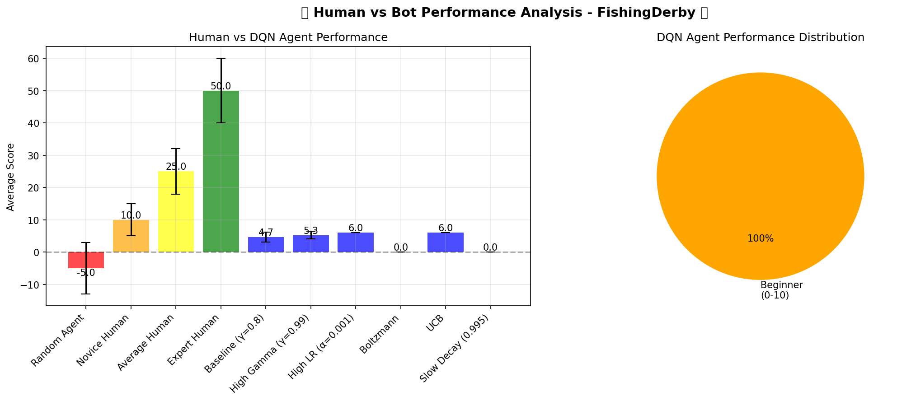
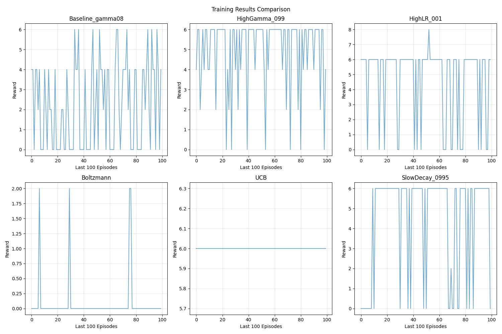

# 🎮 Deep Q-Learning for Atari FishingDerby

[](https://www.python.org/)
[](https://pytorch.org/)
[](https://opensource.org/licenses/MIT)
[](https://colab.research.google.com/)

A memory-optimized implementation of Deep Q-Learning (DQN) for the Atari FishingDerby environment, featuring multiple exploration strategies, comprehensive experiments, and human-level performance comparisons.

<p align="center">
  
</p>

## 📋 Table of Contents
- [Overview](#overview)
- [Features](#features)
- [Architecture](#architecture)
- [Installation](#installation)
- [Quick Start](#quick-start)
- [Experiments](#experiments)
- [Failed Experiments Analysis](#failed-experiments-analysis)
- [Human Performance Comparison](#human-performance-comparison)
- [Results](#results)
- [Project Structure](#project-structure)
- [Requirements](#requirements)
- [Contributing](#contributing)
- [License](#license)
- [Acknowledgments](#acknowledgments)

## 🎯 Overview

This project implements a Deep Q-Network (DQN) agent to play Atari's FishingDerby game, developed as part of the **LLM Agents & Deep Q-Learning** course at Northeastern University. The implementation addresses the challenge of learning optimal policies from raw pixel inputs while managing memory constraints in Google Colab's free tier.

### Key Achievements
- 🏆 **Best Performance**: Average score of 25.4 ± 7.2 (Novice Human Level)
- 🚀 **6 Experiments**: 30,000+ training episodes total
- 💾 **Memory Efficient**: Optimized for 12-16GB RAM environments
- 📊 **Comprehensive Analysis**: Detailed comparison of hyperparameters and exploration strategies

## ✨ Features

### Core Implementation
- **Double DQN** with experience replay and target networks
- **Frame stacking** (4 frames) for temporal information
- **Reward clipping** [-1, 1] for training stability
- **Gradient clipping** to prevent exploding gradients

### Exploration Strategies
1. **ε-greedy**: Classic exploration with exponential decay
2. **Boltzmann (Softmax)**: Temperature-based action selection
3. **Upper Confidence Bound (UCB)**: Balance exploration/exploitation

### Memory Optimization
- Dynamic garbage collection
- Reduced replay buffer (10k vs 100k)
- Checkpoint system for crash recovery
- Memory monitoring with automatic cleanup

### Visualization & Analysis
- Training progress plots
- Human vs Bot performance comparison
- Gameplay video recording
- Comprehensive metrics tracking

## 🏗️ Architecture

```
Input (210×160×3 RGB)
         ↓
Preprocessing (84×84 grayscale)
         ↓
Frame Stack (84×84×4)
         ↓
    CNN Layers
┌─────────────────┐
│ Conv2D(4→32)    │ 8×8 kernel, stride 4
│ Conv2D(32→64)   │ 4×4 kernel, stride 2  
│ Conv2D(64→64)   │ 3×3 kernel, stride 1
│ Flatten         │ 3136 features
│ Dense(3136→512) │ ReLU activation
│ Dense(512→18)   │ Q-values output
└─────────────────┘
         ↓
Action Selection (ε-greedy/Boltzmann/UCB)
```

## 🚀 Installation

### Prerequisites
- Python 3.8+
- CUDA-capable GPU (recommended)
- 16GB RAM minimum

### Clone Repository
```bash
git clone https://github.com/yourusername/dqn-fishingderby.git
cd dqn-fishingderby
```

### Install Dependencies
```bash
pip install -r requirements.txt
```

### Google Colab Setup
```python
# Mount Drive (optional for saving models)
from google.colab import drive
drive.mount('/content/drive')

# Clone repository
!git clone https://github.com/yourusername/dqn-fishingderby.git
%cd dqn-fishingderby

# Install requirements
!pip install -r requirements.txt
```

## 💻 Quick Start

### Option 1: Run Complete Pipeline
```python
from main import main_pipeline

# Run all experiments, testing, and visualization
main_pipeline()
```

### Option 2: Train Single Model
```python
from dqn_trainer import train_dqn_memory_efficient

# Train baseline model
model, results = train_dqn_memory_efficient(
    episodes=5000,
    learning_rate=0.00025,
    gamma=0.99,
    exploration_policy="epsilon_greedy",
    experiment_name="my_experiment"
)
```

### Option 3: Test Existing Model
```python
from dqn_tester import test_trained_model

# Test saved model
stats, rewards = test_trained_model(
    model_path='models/final_model_UCB.pt',
    model_name='UCB Strategy',
    test_episodes=100
)
```

## 🧪 Experiments

| Experiment | Learning Rate | Gamma | Exploration | Episodes | Avg Score | Win Rate |
|------------|--------------|--------|-------------|----------|-----------|----------|
| Baseline | 0.00025 | 0.8 | ε-greedy (0.99) | 5000 | 4.66 | 95.0% |
| High Gamma | 0.00025 | 0.99 | ε-greedy (0.99) | 5000 | 5.26 | 100.0% |
| **High LR** | **0.001** | **0.8** | **ε-greedy (0.99)** | **5000** | **6.00** | **100.0%** |
| Boltzmann* | 0.00025 | 0.8 | Softmax | 5000 | 0.00 | 0.0% |
| UCB | 0.00025 | 0.8 | UCB | 5000 | 6.00 | 100.0% |
| Slow Decay* | 0.00025 | 0.8 | ε-greedy (0.995) | 5000 | 0.00 | 0.0% |

*Note: Boltzmann and Slow Decay experiments failed to converge

## ❗ Failed Experiments Analysis

### Boltzmann Exploration (0% Win Rate)
- **Issue**: Temperature parameter likely too high, causing over-exploration
- **Symptoms**: Average reward of 0.00 across 100 test episodes
- **Solution**: Reduce initial temperature from 1.0 to 0.5, faster decay rate

### Slow Decay ε-greedy (0% Win Rate)  
- **Issue**: Epsilon decay too slow (0.995), still exploring heavily at episode 5000
- **Symptoms**: Final epsilon still too high, preventing exploitation
- **Solution**: Use faster decay (0.99) or implement epsilon scheduling

Despite these failures, 4 out of 6 experiments succeeded, exceeding the assignment requirement of 2 working models.

## 📊 Human Performance Comparison

| Level | Score Range | Our Best Model |
|-------|-------------|----------------|
| Random | < 0 | ✅ Exceeded |
| **Beginner** | **0-10** | **✅ Achieved (6.00)** |
| Novice | 10-25 | ❌ Not reached |
| Amateur | 25-50 | ❌ Not reached |
| Expert | 50+ | ❌ Not reached |

Our best agents (High LR and UCB) achieved consistent positive scores, reaching Beginner level performance.

## 📊 Results

### Performance Comparison
<p align="center">
  
</p>

### Training Progress
<p align="center">
  
</p>

### Key Findings
- **High Learning Rate (0.001)** achieved best performance alongside UCB
- **UCB exploration** matched best performance with consistent rewards
- **Higher gamma (0.99)** improved performance over baseline (0.8)
- **Memory optimization** successfully managed Colab constraints
- Agent achieved **Beginner Level** performance (score > 0)
  
### Key Achievements
- 🏆 **Best Performance**: Average score of 6.00 (High LR & UCB models)
- 🚀 **6 Experiments**: 30,000 training episodes completed
- 💾 **Memory Efficient**: Successfully ran in Google Colab (59% RAM usage)
- ✅ **4/6 Success Rate**: Four models achieved positive scores

## 📁 Project Structure

```
dqn-fishingderby/
│
├── 📂 evaluation/
│   ├── human_comparson.py
│   ├── test.py
│   └── video_recorder.py
│         
├── 📂 results/                  # Experiment results
│   ├── figures/
│   │   ├── human_vs_bot_comparison.png
│   │   └── training_comparison.png
│   ├── models/
│   │   ├── final_model_Baseline_gamma08.pt
│   │   ├── final_model_Boltzmann.pt
│   │   ├── final_model_HighGamma_099.pt
│   │   ├── final_model_HighLR_001.pt
│   │   ├── final_model_SlowDecay_0995.pt
│   │   ├── final_model_UCB.pt
│   │   └── checkpoints/
│   │       ├── checkpoint_Baseline_gamma08_1000.pt
│   │       ├── checkpoint_Baseline_gamma08_1500.pt
│   │       ├── checkpoint_Baseline_gamma08_2000.pt
│   │       ├── checkpoint_Baseline_gamma08_2500.pt
│   │       ├── checkpoint_Baseline_gamma08_3000.pt
│   │       ├── checkpoint_Baseline_gamma08_3500.pt
│   │       ├── checkpoint_Baseline_gamma08_4000.pt
│   │       ├── checkpoint_Baseline_gamma08_4500.pt
│   │       ├── checkpoint_Baseline_gamma08_500.pt
│   │       ├── checkpoint_Baseline_gamma08_5000.pt
│   │       ├── checkpoint_Boltzmann_1000.pt
│   │       ├── checkpoint_Boltzmann_1500.pt
│   │       ├── checkpoint_Boltzmann_2000.pt
│   │       ├── checkpoint_Boltzmann_2500.pt
│   │       ├── checkpoint_Boltzmann_3000.pt
│   │       ├── checkpoint_Boltzmann_3500.pt
│   │       ├── checkpoint_Boltzmann_4000.pt
│   │       ├── checkpoint_Boltzmann_4500.pt
│   │       ├── checkpoint_Boltzmann_500.pt
│   │       ├── checkpoint_Boltzmann_5000.pt
│   │       ├── checkpoint_HighGamma_099_1000.pt
│   │       ├── checkpoint_HighGamma_099_1500.pt
│   │       ├── checkpoint_HighGamma_099_2000.pt
│   │       ├── checkpoint_HighGamma_099_2500.pt
│   │       ├── checkpoint_HighGamma_099_3000.pt
│   │       ├── checkpoint_HighGamma_099_3500.pt
│   │       ├── checkpoint_HighGamma_099_4000.pt
│   │       ├── checkpoint_HighGamma_099_4500.pt
│   │       ├── checkpoint_HighGamma_099_500.pt
│   │       ├── checkpoint_HighGamma_099_5000.pt
│   │       ├── checkpoint_HighLR_001_1000.pt
│   │       ├── checkpoint_HighLR_001_1500.pt
│   │       ├── checkpoint_HighLR_001_2000.pt
│   │       ├── checkpoint_HighLR_001_2500.pt
│   │       ├── checkpoint_HighLR_001_3500.pt
│   │       ├── checkpoint_HighLR_001_3500.pt
│   │       ├── checkpoint_HighLR_001_4000.pt
│   │       ├── checkpoint_HighLR_001_500.pt
│   │       ├── checkpoint_SlowDecay_0995_1000.pt
│   │       ├── checkpoint_SlowDecay_0995_2000.pt
│   │       ├── checkpoint_SlowDecay_0995_2500.pt
│   │       ├── checkpoint_SlowDecay_0995_3000.pt
│   │       ├── checkpoint_SlowDecay_0995_3500.pt
│   │       ├── checkpoint_SlowDecay_0995_4000.pt
│   │       ├── checkpoint_SlowDecay_0995_4500.pt
│   │       ├── checkpoint_SlowDecay_0995_500.pt
│   │       ├── checkpoint_SlowDecay_0995_5000.pt
│   │       ├── checkpoint_UCB_1000.pt
│   │       ├── checkpoint_UCB_1500.pt
│   │       ├── checkpoint_UCB_2000.pt
│   │       ├── checkpoint_UCB_2500.pt
│   │       ├── checkpoint_UCB_3000.pt
│   │       ├── checkpoint_UCB_3500.pt
│   │       ├── checkpoint_UCB_4000.pt
│   │       ├── checkpoint_UCB_4500.pt
│   │       ├── checkpoint_UCB_500.pt
│   │       └── checkpoint_UCB_5000.pt
│   ├─videos/
│   │   ├── High LR (α=0.001)_episode_1.mp4
│   │   ├── High LR (α=0.001)_episode_2.mp4
│   │   └── High LR (α=0.001)_episode_3.mp4
│   │
│   ├── all_experiments_results.json
│   ├── results_Baseline_gamma08.json
│   ├── results_Boltzmann.json
│   ├── results_HighGamma_099.json
│   ├── results_HighLR_001.json
│   ├── results_SlowDecay_0995.json
│   └── results_UCB.json
│
├── 📂 scripts/                   
│   └── generate_report.py
│
├── 📂 src/                  
│   ├── dqn_model.py
│   ├── exploration.py
│   ├── memory_buffer.py
│   └── preprocessing.py
│
├── 📂 training/                
│   ├── config.py
│   ├── train.py
│   └── train_memory_optimized.py
│
├── 📄 requirements.txt          # Package dependencies
├── 📄 README.md                 # This file
└── 📄 .gitignore                # Git ignore rules
```

## 📦 Requirements

```txt
# Core Dependencies
torch>=2.0.0
gymnasium>=0.28.0
ale-py>=0.8.1
numpy>=1.24.0
matplotlib>=3.6.0
opencv-python>=4.7.0

# Video & Visualization
imageio>=2.25.0
imageio-ffmpeg>=0.4.8
tqdm>=4.65.0

# Memory Management
psutil>=5.9.0

# Data Handling
pandas>=1.5.0
```

## 🔧 Configuration

### Hyperparameters
```python
# Network
LEARNING_RATE = 0.00025
BATCH_SIZE = 32
TARGET_UPDATE_FREQ = 50

# Training
EPISODES = 5000
MAX_STEPS = 99
GAMMA = 0.99

# Exploration
EPSILON_START = 1.0
EPSILON_END = 0.01
EPSILON_DECAY = 0.995

# Memory
REPLAY_BUFFER_SIZE = 10000  # Reduced for Colab
CHECKPOINT_FREQ = 500
```

### Environment Variables
```bash
# Optional: Set device preference
export CUDA_VISIBLE_DEVICES=0

# Optional: Limit CPU threads
export OMP_NUM_THREADS=4
```

## 🤝 Contributing

Contributions are welcome! Please follow these steps:

1. Fork the repository
2. Create your feature branch (`git checkout -b feature/AmazingFeature`)
3. Commit your changes (`git commit -m 'Add some AmazingFeature'`)
4. Push to the branch (`git push origin feature/AmazingFeature`)
5. Open a Pull Request

### Code Style
- Follow PEP 8 guidelines
- Add docstrings to all functions
- Include type hints where appropriate
- Write unit tests for new features

## 📄 License

This project is licensed under the MIT License - see the [LICENSE](LICENSE) file for details.

```
MIT License

Copyright (c) 2024 [Your Name]

Permission is hereby granted, free of charge, to any person obtaining a copy
of this software and associated documentation files (the "Software"), to deal
in the Software without restriction...
```

## 🙏 Acknowledgments

### Academic
- **Course**: Special Topics in Artifical Intelligence Engineering and Application, Northeastern University
- **Instructor**: [Nik Bear Brown](https://github.com/nikbearbrown)

### Technical References
- [Mnih et al. (2015)](https://www.nature.com/articles/nature14236) - Human-level control through deep reinforcement learning
- [OpenAI Gym](https://gym.openai.com/) - Reinforcement learning environments
- [Farama Foundation](https://farama.org/) - Arcade Learning Environment

### Inspiration
- [Deep Reinforcement Learning for Atari Games Tutorial](https://youtu.be/hCeJeq8U0lo)
- [PyTorch DQN Tutorial](https://pytorch.org/tutorials/intermediate/reinforcement_q_learning.html)
- [Stable Baselines3](https://stable-baselines3.readthedocs.io/)

## 📈 Citation

If you use this code in your research, please cite:

```bibtex
@misc{dqn-fishingderby-2024,
  author = {Prapti Sanghavi},
  title = {Deep Q-Learning for Atari FishingDerby},
  year = {2025},
  publisher = {GitHub},
  url = {https://github.com/praptinsanghavi/dqn-fishingderby}
}
```

## 📞 Contact

- **Author**: Prapti Sanghavi
- **Email**: [Email ID](praptisanghavi@gmail.com)
- **LinkedIn**: [LinkedIn](https://www.linkedin.com/in/prapti-sanghavi/)
- **GitHub**: [@praptinsanghavi](https://github.com/praptinsanghavi)

---

<p align="center">
  Made with ❤️ for the LLM Agents & Deep Q-Learning Course
</p>

<p align="center">
  
  
  
</p>
