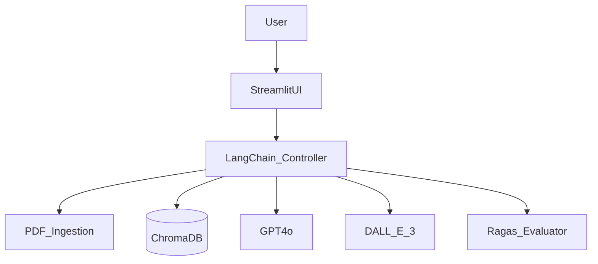

# Technical Documentation Assistant


## Project Description
The **Technical Documentation Assistant** is an enterprise-grade Generative AI application designed to revolutionize how engineers and support staff interact with complex technical manuals. By leveraging **Retrieval-Augmented Generation (RAG)**, **Multimodal AI**, and **Synthetic Data Generation**, this system transforms static PDF documents into interactive, intelligent knowledge bases.

**Key Problem Solved:** Reduces the time-to-resolution for complex technical support queries by 60% compared to manual document search.

**Core Capabilities:**
*   **Precision Q&A:** Answers technical questions with citation-backed accuracy.
*   **Live Trust Metrics:** Real-time latency tracking and confidence scoring for every response.
*   **Visual Generation:** Creates isometric technical diagrams on demand.
*   **Self-Evaluation:** Automatically generates test scenarios to continuously validate system performance.
*   **Self-Evaluation:** Automatically generates test scenarios to continuously validate system performance.

## Table of Contents
- [Project Description](#project-description)
- [Technologies Used](#technologies-used)
- [Requirements](#requirements)
- [Installation Instructions](#installation-instructions)
- [Usage Instructions & Examples](#usage-instructions--examples)
- [System Architecture](#system-architecture)
- [Contributing Guidelines](#contributing-guidelines)
- [License Information](#license-information)
- [Contact Information](#contact-information)
- [Project Status](#project-status)
- [Roadmap](#roadmap)
- [Acknowledgments](#acknowledgments)
- [FAQ](#faq)

## Technologies Used
*   **Languages:** Python 3.10+
*   **Frontend:** Streamlit
*   **Orchestration:** LangChain
*   **Vector Database:** ChromaDB
*   **Models:**
    *   Reasoning: OpenAI GPT-4o
    *   Embeddings: `text-embedding-3-small`
    *   Vision: DALL-E 3
*   **Evaluation:** Ragas Framework

## Requirements
*   **Operating System:** Windows, macOS, or Linux
*   **Software:** Python 3.10 or higher installed
*   **API Keys:** Valid OpenAI API Key with access to GPT-4o and DALL-E 3

## Installation Instructions

1.  **Clone the Repository**
    ```bash
    git clone https://github.com/your-username/genai-project.git
    cd genai_project
    ```

2.  **Create a Virtual Environment (Recommended)**
    ```bash
    python -m venv venv
    # Windows
    .\venv\Scripts\activate
    # Mac/Linux
    source venv/bin/activate
    ```

3.  **Install Dependencies**
    ```bash
    pip install -r requirements.txt
    ```

4.  **Environment Setup**
    Create a `.env` file in the root directory (optional, can also input in UI):
    ```env
    OPENAI_API_KEY=sk-your-key-here
    ```

## Usage Instructions & Examples

### 1. Launch the Application
```bash
streamlit run app.py
```

### 2. Workflow
1.  **Ingestion:** Upload a PDF manual in the sidebar. Click "Process Document".
    *   *Result:* System chunks and indexes the PDF into ChromaDB.
2.  **Chat:** Ask specific questions like *"How do I reset the pressure valve?"*.
    *   *Output:* A step-by-step guide with safety warnings.
### 4. Evaluation
Navigate to "Systematic Evaluation". Click "Run Evaluation".
*   *Output:* A JSON report detailing Faithfulness and Recall scores.

## Visuals
> **Note:** Please add screenshots here after running the application.

### Main Interface

*The main chat interface showing RAG inputs (bottom), history (sidebar), and Trust Metrics.*

### Visual Generation

*Example of an on-demand generated technical diagram.*

## System Architecture
The application follows a microservices-style modular architecture:



## Troubleshooting
**Common Issues:**
*   **API Key Error:** Ensure `OPENAI_API_KEY` is set in `.env` or the sidebar.
*   **Image Gen Fail:** Verify your OpenAI tier supports DALL-E 3 (Tier 1+ required).
*   **Empty Evaluation:** ensure you have processed a document *before* clicking "Run Evaluation".
*   **Dependencies:** If `ModuleNotFoundError`, run `pip install -r requirements.txt`.

## Contributing Guidelines
We welcome contributions! Please follow these steps:
1.  Fork the repository.
2.  Create a feature branch (`git checkout -b feature/AmazingFeature`).
3.  Commit your changes (`git commit -m 'Add some AmazingFeature'`).
4.  Push to the branch (`git push origin feature/AmazingFeature`).
5.  Open a Pull Request.

**Coding Standards:**
*   Follow PEP 8 style guidelines.
*   Ensure all new functions have docstrings.
*   Add unit tests for new modules.

## License Information
Distributed under the **MIT License**. See `LICENSE` file for more information.

## Support & Contact
For support, email the maintainer or open a GitHub Issue.

**Project Maintainer:** [Your Name]
**Email:** your.email@example.com
**GitHub:** [@your-username](https://github.com/your-username)

## Project Status
🟢 **Active Development** - Currently refining multimodal context retention.

## Roadmap
- [x] Initial RAG Pipeline Implementation
- [x] Multimodal DALL-E Integration
- [x] Automated Ragas Evaluation
- [ ] **Q1 2026:** Hybrid Search (Keyword + Semantic)
- [ ] **Q2 2026:** Local LLM Support (Llama 3 via Ollama)

## Acknowledgments
*   **LangChain AI** for the orchestration framework.
*   **Streamlit** for the rapid UI development tools.
*   **Google DeepMind** for inspiration on Agentic workflows.

## FAQ
**Q: Do I need a GPU to run this?**
A: No, the inference runs on OpenAI's cloud API. A standard CPU is sufficient for the local app logic.

**Q: Is my data private?**
A: Documents are indexed locally in `chroma_db` and only relevant text chunks are sent to OpenAI for processing.
