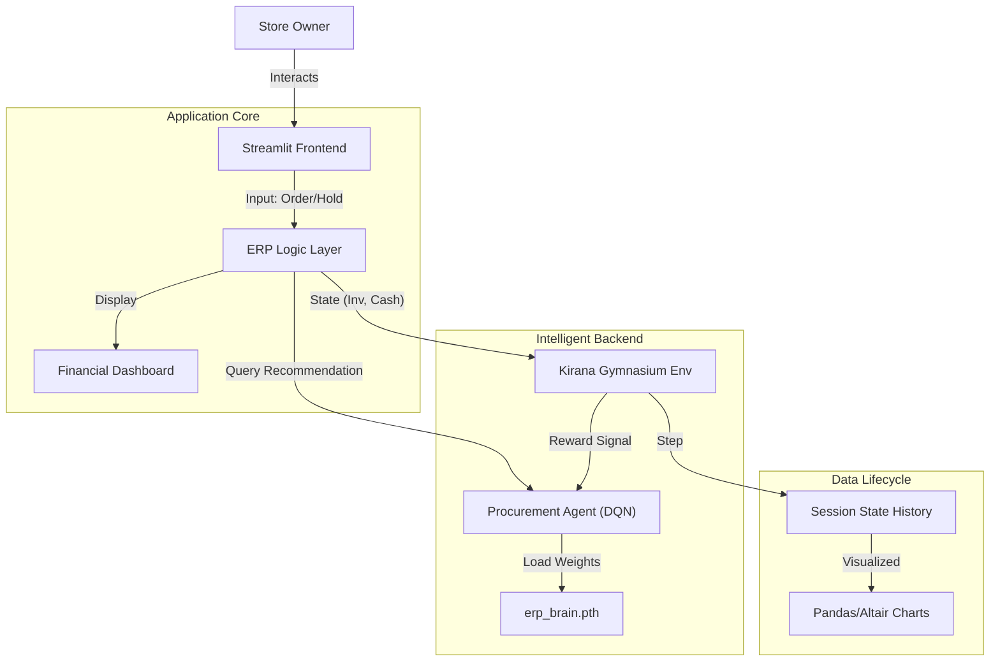

# Retail Union: Smart ERP with AI Copilot

**Production-Grade Enterprise Resource Planning for Hyperlocal Retail**

---

## 1. Project Overview

**Retail Union** is a "Smart ERP" system designed for hyperlocal "Kirana" (mom-and-pop) stores. It solves the critical problem of inventory optimization under cash constraints by simulating the trade-offs between low-cost/long-lead-time procurement (Manufacturers) and high-cost/instant procurement (Distributors).

The core idea is to empower small retailers with an **AI Copilot** (Deep Q-Network) that learns to plan ahead, ordering from manufacturers to maximize margins while avoiding stockouts.

**High-Level Architecture**: The system utilizes a **Streamlit** frontend for the interactive ERP dashboard, coupled with a custom **Gymnasium** reinforcement learning environment (`KiranaClusterEnv`) and a **PyTorch**-based DQN agent (`ProcurementAgent`) for decision support.

---

## 2. Architecture Breakdown

### System Diagram



### Components

#### 1. Frontend (Streamlit)
*   **Purpose**: Provides the operational interface for the store owner.
*   **Logic**: Manages session state, renders metrics (`Inventory`, `Cash`), and captures user actions.
*   **Dependencies**: `streamlit`, `pandas`.
*   **Contracts**: Inputs integer actions (0-2) to the backend; receives `(observation, reward, info)` tuples.
*   **Failure Modes**: Session reset on browser refresh (handled via `st.session_state` persistence logic).

#### 2. Backend Environment (`KiranaClusterEnv`)
*   **Purpose**: Simulates the business physics (Lead times, Demand, Cash flow).
*   **Internal Logic**:
    *   **Demand**: Poisson distribution ($\lambda=5$).
    *   **Lead Times**: 3 Days (Mfg) vs 0 Days (Dist).
    *   **Bankruptcy**: Terminates if `cash < 0`.
*   **Dependencies**: `gymnasium`, `numpy`.
*   **Hidden Assumptions**: Market prices are static; demand is stationary.

#### 3. AI Agent (`ProcurementAgent`)
*   **Purpose**: Suggests optimal inventory actions.
*   **Internal Logic**: Double Deep Q-Network (DDQN) with Experience Replay.
*   **Inputs**: `[Inventory, Cash, PendingOrders]`.
*   **Outputs**: `argmax(Q-Values)` -> Action Index.
*   **Limitations**: Requires pre-trained weights (`erp_brain.pth`) for optimal performance; acts greedily during inference.

---

## 3. Technology Stack

| Component | Technology | Version | Reason for Choice |
| :--- | :--- | :--- | :--- |
| **Frontend** | Streamlit | 1.30+ | Rapid prototyping of data-heavy dashes without complex JS. |
| **Simulation** | Gymnasium | 0.29+ | Standard API for RL environments; ensures modularity. |
| **AI/ML** | PyTorch | 2.0+ | Dynamic computation graph ideal for training DQN agents. |
| **Data** | Pandas, NumPy | Latest | Efficient vector operations for state management. |
| **Testing** | Pytest | 7.0+ | Industry standard for Python unit testing. |
| **Container** | Docker | 24.0+ | Ensures consistent deployment environment. |

---

## 4. Installation

### Prerequisites
*   **OS**: Windows, macOS, or Linux.
*   **Python**: 3.9, 3.10, or 3.11.
*   **Docker** (Optional, for containerized run).

### Step-by-Step Instructions

1.  **Clone the Repository**
    ```bash
    git clone https://github.com/your-org/retail-union.git
    cd retail-union
    ```

2.  **Create Virtual Environment**
    *   *Windows*:
        ```powershell
        python -m venv venv
        .\venv\Scripts\activate
        ```
    *   *Mac/Linux*:
        ```bash
        python3 -m venv venv
        source venv/bin/activate
        ```

3.  **Install Dependencies**
    ```bash
    pip install -r requirements.txt
    ```
    *Troubleshooting*: If `torch` installation fails, visit [pytorch.org](https://pytorch.org/) for system-specific commands.

4.  **Verify Installation**
    ```bash
    pytest tests/
    ```
    Ensure all tests pass.

---

## 5. Configuration

Configuration is managed via class attributes in `src/simulation/kirana_env.py` and `src/agents/procurement_agent.py`.

### Environment Parameters (`KiranaClusterEnv`)

| Parameter | Default | Description | Impact of Misconfiguration |
| :--- | :--- | :--- | :--- |
| `max_inventory` | `100` | Maximum warehouse capacity. | Agent may over-order if set too high relative to sales. |
| `start_cash` | `5000` | Initial capital. | Immediate bankruptcy if set too low (< Cost of 1 order). |
| `COST_MFG` | `70` | Unit cost for Manufacturer. | Changes economic incentives; Agent may fail to converge. |
| `COST_DIST` | `100` | Unit cost for Distributor. | Reduces penalty for urgent orders. |
| `STOCKOUT_PENALTY` | `50` | Negative reward per missed sale. | Agent becomes overly risk-averse if too high. |

### Agent Parameters (`ProcurementAgent`)

| Parameter | Default | Description | Edge Cases |
| :--- | :--- | :--- | :--- |
| `lr` | `1e-3` | Learning Rate. | `>1e-1`: Divergence. `<1e-5`: Slow learning. |
| `gamma` | `0.99` | Discount Factor. | `0`: Agent becomes myopic (only cares about immediate reward). |
| `epsilon_decay` | `0.995` | Exploration decay. | `1.0`: Never stops exploring (random actions). |

---

## 6. Running the Application

### Development Mode (Local)
Run the Streamlit app with hot-reloading enabled:
```bash
streamlit run dashboard.py
```
*Output*:
```
  You can now view your Streamlit app in your browser.
  Local URL: http://localhost:8501
  Network URL: http://192.168.1.5:8501
```

### Production Mode (Docker)
Build and run the containerized application.

1.  **Build Image**:
    ```bash
    docker build -t retail-union .
    ```
2.  **Run Container**:
    ```bash
    docker run -p 8501:8501 retail-union
    ```
    Access via `http://localhost:8501`.

### Training the AI
To retrain the brain (`erp_brain.pth`):
```bash
python train.py
```
This runs the training loop and saves the updated model weights.

---

## 7. API Reference

Since this is an internal library, the "API" refers to the Python class interfaces.

### `KiranaClusterEnv`

**`reset(seed=None) -> (obs, info)`**
*   Resets simulation to Day 0, Cash 5000, Inv 20.
*   **Returns**: `numpy.ndarray` of shape `(3,)`.

**`step(action: int) -> (obs, reward, term, trunc, info)`**
*   Executes one day of operations.
*   **Input**:
    *   `0`: Hold
    *   `1`: Buy Mfg (15 units, -1050 cash, +3 days lag)
    *   `2`: Buy Dist (10 units, -1000 cash, Instant)
*   **Returns**: Standard Gymnasium tuple.
*   **Status Codes**:
    *   `term=True`: Bankruptcy (`cash < 0`) or Time Limit (`day >= 365`).
    *   `reward=-10`: Invalid action (Insufficient cash).

---

## 8. Data Model Documentation

### State Vector (Observation)
The core data structure passed between Env and Agent.

| Index | Field | Type | Range | Description |
| :--- | :--- | :--- | :--- | :--- |
| `0` | `Inventory` | `float32` | `0` - `100` | Current stock on hand. |
| `1` | `Cash` | `float32` | `-Inf` - `Inf` | Cash balance scaled by `/1000` (e.g., 5.0 = 5000 INR). |
| `2` | `Pending` | `float32` | `0` - `Inf` | Total units ordered but not yet arrived. |

### Session State (`st.session_state`)
*   `env`: Instance of `KiranaClusterEnv`.
*   `ai_brain`: Instance of `ProcurementAgent`.
*   `history_cash`: List[`float`] of cash over time.
*   `history_inv`: List[`float`] of inventory over time.

---

## 9. Frontend Details

### Component Hierarchy
*   **Sidebar**:
    *   `Operations Console`: Metrics (Stock, Cash, Pipeline).
    *   `Recommendation Engine`: Displays AI suggestion.
    *   `Action Panel`: Radio buttons for user decision.
*   **Main Area**:
    *   `Financial Performance`: Line chart of Cash/Inventory history.
    *   `Supply Chain Pipeline`: List of incoming shipments (e.g., "15 Units in 2 Days").

### State Management
Streamlit reruns the entire script on interaction. We use `st.session_state` to persist the Environment object across reruns, ensuring the simulation continues rather than restarting.

---

## 10. Testing Guide

The project uses `pytest` for automated testing. Code coverage target is **>80%**.

### Running Tests
```bash
# Run all tests
pytest tests/

# Run with coverage report
pytest tests/ --cov=src
```

### Test Strategy
*   **Unit Tests (`test_env.py`)**: Verify business logic (Inventory updates, Bankruptcy triggers, Cost calculations).
*   **Mocking**: Tests do NOT mock the Env logic to ensure end-to-end correctness of the simulation physics.

---

## 11. Deployment Guide

### CI/CD Pipeline
Managed via GitHub Actions (`.github/workflows/ci.yml`).
1.  **Trigger**: Push to `main`.
2.  **Steps**: Checkout -> Setup Python -> Install Deps -> Run Pytest.
3.  **Failure**: Blocks merge if tests fail.

### Recommended Infrastructure
*   **Platform**: AWS EC2 (t3.micro) or Google Cloud Run.
*   **Strategy**: Deploy the Docker container behind a load balancer (though state is local, so sticky sessions required if multi-instance).

---

## 12. Security Considerations

*   **Input Validation**: The `step()` method validates `action` indices and checks `cash >= cost` before execution.
*   **Isolation**: The simulation runs in a containerized environment (Docker) to isolate dependencies.
*   **Attack Vectors**:
    *   *DoS*: Streamlit apps can be resource-intensive. Rate limiting at the load balancer level is recommended for public deployment.
    *   *State Manipulation*: Since state is client-session bound (in memory), a refresh wipes progress. This is a feature, not a bug, for this simulation tool.

---

## 13. Performance Notes

*   **Inference Latency**: The DQN model is lightweight (3 layers, <10k params). Inference takes **<5ms** on CPU.
*   **Scaling**: Streamlit is single-threaded per session. Vertical scaling (more CPU/RAM) is preferred over horizontal scaling due to stateful nature.
*   **Bottlenecks**: Rendering large charts in `st.line_chart` after thousands of simulation steps may slow down the frontend.

---

## 14. Failure Modes & Recovery

| Failure | Cause | Detection | Recovery |
| :--- | :--- | :--- | :--- |
| **Bankruptcy** | `Cash < 0` due to over-ordering. | `Terminated=True` in Environment. | User must click "Reset" or refresh page. |
| **Model Divergence** | High Learning Rate. | Agent consistently buys 0 or Max. | Retrain with lower `lr` (python `train.py`). |
| **Session Loss** | Browser Refresh / Tab Close. | State resets to Day 0. | None (Design choice). |

---

## 15. Roadmap

*   **Short-Term**:
    *   [ ] Add `Stockout Risk` metric to Dashboard.
    *   [ ] Persist High Scores (Max Profit) to local file.
*   **Long-Term**:
    *   [ ] **PostgreSQL Integration**: Replace in-memory history with persistent DB.
    *   [ ] **Multi-Store Mode**: Allow multiple users to compete in the same market.
*   **Technical Debt**:
    *   Refactor `dashboard.py` to move UI logic into `src/presentation/`.

---

## 16. FAQ & Troubleshooting

**Q: Why does the AI recommendation say "HOLD" when I have 0 inventory?**
A: The AI might predict that a pending order is arriving tomorrow, or it has learned that the stockout penalty is cheaper than the distributor cost in this specific state (rare, but possible).

**Q: `ModuleNotFoundError: No module named 'src'`**
A: Ensure you run commands from the project root (`retail_union/`) and `PYTHONPATH` includes the current directory.

**Q: Docker container exits immediately.**
A: Check the logs: `docker logs <container_id>`. Ensure `requirements.txt` was copied correctly.

---

## 17. License

This project is licensed under the **MIT License**. See `LICENSE` file for details.

---

## 18. Credits

**Architect & Developer**: [Your Name/Team]
**Frameworks**: Streamlit, Gymnasium, PyTorch.
**Special Thanks**: To the Kirana store owners who inspired this solution.
